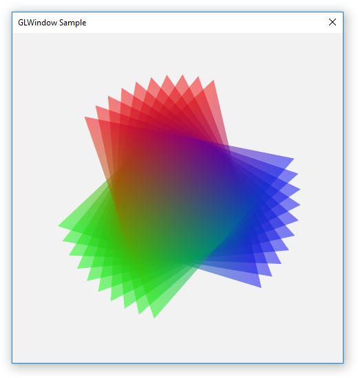
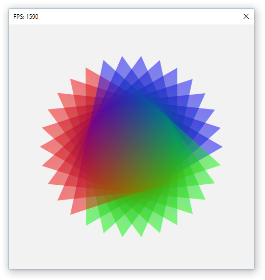
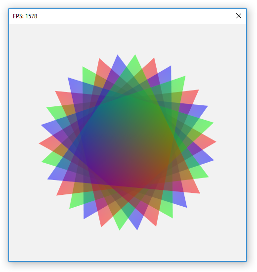

# GLWindow

- easy
- fast
- hackable
- free

Window with OpenGL support. Thats all!

- [GLWindow on Github](https://github.com/cprogrammer1994/GLWindow)
- [GLWindow on PyPI](https://pypi.python.org/pypi/GLWindow)
- [Documentation](https://glwindow.readthedocs.io)

## Sample code

```python
wnd = GLWindow.create_window()

while wnd.update():
    pass
```

## Examples

```sh
python -m GLWindow
```





## Description

GLWindow was built for windows to support [ModernGL] examples.
Easy to use and great for commertial projects.
[MIT] License.

## Linux and Mac support

I barley find the time to implement GLWindow on Linux and Mac.
If you know how to do this, feel free to raise a [PR] or write an [Issue] to discuss the implementation.

[MIT]: LICENSE
[ModernGL]: https://github.com/cprogrammer1994/ModernGL
[PR]: https://github.com/cprogrammer1994/GLWindow/pulls
[Issue]: https://github.com/cprogrammer1994/GLWindow/issues
